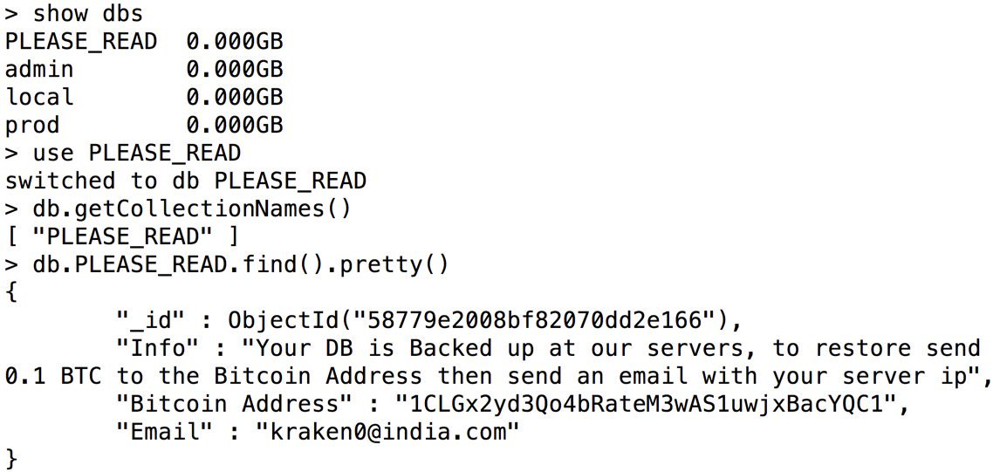
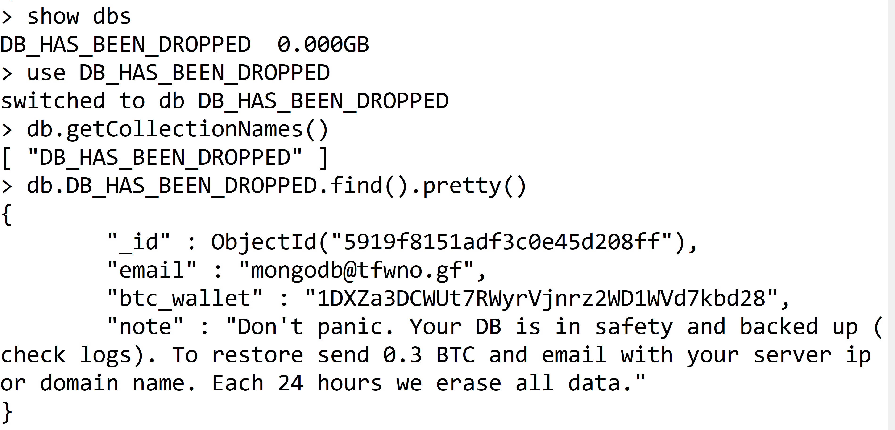

# revconf2017
HackedDB - how to un-hack-ify your database

## Seeing the hacked database

Wondering how my database got hacked? Pretty simple, actually:
 - Didn't enable auth
 - Connected the database server to all network interfaces (y'know, so I, Developer, could use my desktop tools)
 - Didn't set up any IP-filtering on incoming traffice (y'know, because, *nobody* knows about my database y'all...).

 This was my initial ransom note:

 

 I inadvertently left my database server running for a short period of time. And wouldn't ya know it: it got hacked again:

 

Ok - enough of hacked databases. Timme to un-hack-ify. This talk presents four simple "low-hanging fruit" things you can do, to help lock down your database:

 - Built-in database security
 - Virtual networks
 - Jumpboxes
 - IP whitelisting

While many database engines have security issues out-of-the-box, we'll use MongoDB for our examples here, since it's such a well-known database (and has very simple tools to demonstrate with).

# Part 1: Database security

Out-of-the-box, some databases don't have authentication enabled, and attach the database to all network bindings. Great for a quick install + demo, terrible for any real use. In the news, we've seen so many *ransomware* attacks on databases such as MongoDB, Elasticsearch, and CouchDB, where there's no initial auth configured. The CouchDB docs even call this scenario an "Admin party" (not sure why they chose to  make light of this scenario, but...).


Fortunately, several database vendors fixed the network binding issue.

## Example: Enabling security

MongoDB defaults to a no-auth model, with localhost-only access. We'll add an admin user, enable auth, and add an "app" user.

## Connect without security, add admin user

We use the `mongo` command line tool to connect to our non-secure instance, from localhost (you will not be able to connect from outside the machine you installed mongodb on, by default). Then, we add an administrative user:

```
use admin
db.dropUser('revconfadmin')
db.createUser(
  {
    user: "revconfadmin",
    pwd: "revconfadmin",
    roles: [ { role: "userAdminAnyDatabase", db: "admin" } ]
  }
)
```

## Enable auth with admin user

We then exit `mongo`, and edit `/etc/mongod.conf` to enable auth. Find the Security section, uncomment the section header, and modify to the following:

```
security:
  authorization: "enabled"
```

Now we restart the mongod service:

`sudo service mongod restart`

We re-connect to the database, as admin:

`mongo -u "revconfadmin" -p "revconfadmin" --authenticationDatabase "admin"`

Or...

`mongo`
Followed by:
```
use admin
db.auth("revconfadmin","revconfadmin")
```

## Add app-level user

Ok, now we switch to the app's database (in this case, I called it `revconf`) and add a user for the app:

```
use revconf
db.createUser(
  {
    user: "revconfuser",
    pwd: "revconfuser",
    roles: [ { role: "dbOwner", db: "revconf" } ]
  }
)
```

At this point, an app server can connect with these credentials:

```

mongo -u "revconfuser" -p "revconfuser" --authenticationDatabase "revconf"

```

This can easily be done in code as well. We're just using the shell for demonstration purposes.

Note: It's important to have a separate login for an app, vs using the admin credentials. Admin has privileges to create/delete any database. Not something you should provide at an application level.

# Virtual networks

## Connect without a vnet

If our app server is not in the same vnet, the app server must connect through the database server's public IP address. Let's set up an inbound security rule to allow this.

## Connect with vnet

First we'll look at the vnet configuration, and see the different vm's (and internal ip addresses) of those vm's.

To make things safer, we'll connect from an app server that's been placed within the same vnet as the database server.

And since we're connecting within the vnet, we no longer need our inbound connection - let's delete it.

*still a work in progress*

# Jumpbox

*tbd*

# IP Whitelisting

*tbd*

